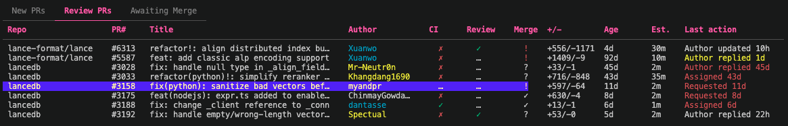

# reviewer-tui

A terminal UI for keeping up with open PRs across multiple GitHub repositories.



## Features

- **Three tabs**: New PRs, Review PRs (PRs you've reviewed), Awaiting Merge (PRs you've approved)
- **Priority ranking**: PRs are scored by CI status, author association, review request, and label matches
- **Author colors**: maintainers (cyan), external contributors (white), new contributors (yellow), bots (dim)
- **Last action column** (Review tab): shows context-aware state — "Author updated", "Author replied", "Changes req'd", etc., with age-based color escalation
- **LLM triage** (optional): uses Claude Haiku to estimate review effort and generate a one-line summary per PR, shown in the "Est." column and status bar
- **Snooze / dismiss**: hide PRs temporarily or permanently from the New tab

## Requirements

- [gh](https://cli.github.com/) — authenticated with your GitHub account
- Go 1.21+
- (Optional) [Claude Code CLI](https://claude.ai/code) for LLM triage

## Install

```sh
go install github.com/wjones127/reviewer-tui@latest
```

Or build from source:

```sh
go build -o reviewer-tui .
```

## Configuration

Copy the example config and edit it:

```sh
mkdir -p ~/.config/reviewer-tui
cp config.toml.example ~/.config/reviewer-tui/config.toml
```

```toml
user = "your-github-username"

repos = [
    "myorg/myrepo",
]

# Labels that boost PR priority
tags = ["python", "rust"]

# Optional: enable LLM effort estimates (requires claude CLI)
# triage_enabled = true
```

## Usage

```sh
reviewer-tui
```

| Key | Action |
|-----|--------|
| `←` / `→` | Switch tabs |
| `↑` / `↓` | Move cursor |
| `enter` / `o` | Open PR in browser |
| `a` | Assign yourself as reviewer |
| `c` | Approve pending CI workflows |
| `s` | Snooze PR for 2 days |
| `d` | Dismiss PR |
| `D` | Toggle dismissed PRs |
| `r` | Refresh from GitHub |
| `q` | Quit |

## Data

PRs are cached in a local SQLite database at `~/.config/reviewer-tui/data.db`. Logs go to `~/.config/reviewer-tui/debug.log`.
